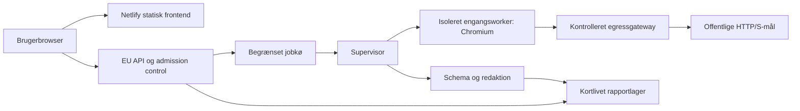

# Teknisk arkitektur

## Komponenter og tillidsgrænser



Frontend ejer præsentation, aldrig scanning eller scoreberegning som autoritativ kilde. API ejer kvoter, tokens, kø og livscyklus. Worker er upålidelig efter kontakt med målsiden. Supervisor validerer output og råder over kill/delete. Netværksgateway ejer destination-, metode- og bytegrænser. Rapportlager må ikke kunne nås fra browserworkerens netværk.

## Valgt buildretning

TypeScript strict monorepo. React + Vite til statisk frontend på Netlify. Separat Node.js API og Playwright/Chromium-worker på EU-infrastruktur. Runtime-, framework- og browserversioner vælges som vedligeholdte stabile udgaver ved første build, låses i lockfile og containerdigest og registreres i release. Dokumentet foreskriver ikke et ubekræftet versionsnummer.

Planlagt struktur:

```text
apps/web/                 UI, routes, locale og tilgængelige komponenter
services/api/             admission, status, tokens og deletion
services/scanner/         supervisor og engangsworker
packages/contracts/      runtime schemas og genererede typer
packages/rules/          deterministisk klassifikation og indikatorer
packages/content/        da, forklaringer og ordliste
packages/design-tokens/  farver, spacing og typografi
tests/fixtures/          syntetiske mål og rapporter
infra/                   verificerbar isolation, gateway og deployment
docs/                    normativt byggegrundlag
```

Dette er fremtidig struktur, ikke allerede oprettede kodepakker. Jobkø og rapportlager skal understøtte atomisk status, TTL og kvoter på tværs af replikaer. En enkeltprocesses in-memory limiter er kun tilladt i lokal fixture-mode. Valg af konkret lager og hosting følger ADR-007.

## Dataflow

URL → API-validering/kvote → job → supervisor → worker/gateway → redigerede observationer → schema → regelsæt → immutable rapport → tokenbeskyttet API → UI. AI, hvis senere aktiveret, modtager kun en allowlistet projektion af rapporten og returnerer forklaringer til et separat felt. AI har ingen forbindelse til scanner eller vilkårlige URL'er.

Sikkerhed, dataminimering og kvalitet håndhæves på serveren. Klientvalidering er kun hjælp. CORS er ikke autentifikation. API'et vil være offentligt kendt og skal være robust uden skjulte frontendnøgler.

## Stabilitet og kapacitet

API og UI skal fortsat vise fejl og metode, når workerpoolen er stoppet. Kø har fast maxstørrelse og jobdeadline; ingen ubegrænset autoskalering. Start med to samtidige workers globalt. Mål ressourcebrug mod kontrollerede fixtures før pilot. Ingen live-data i frontendbuild, logs eller deploy previews.

Regelsæt er rene funktioner. Forklaringstekster og UI kan deployes separat, men understøttede schemaVersion'er skal være eksplicitte. Ukendt schema afvises med en forståelig fejl, aldrig tavs feltgætning. Scanner og API skal kunne rulles tilbage som kompatibelt sæt.
